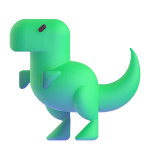

# As-salamu alaykum 

I'm Tarikul, a passionate full-stack developer and undergrad student with 3 years of professional coding experience.

My journey began with web development, but my curiosity extends to the exciting world of AI, ML, and data science. Recently, I've delved into these fields and am eager to become a master. I also possess intermediate skills in developing cross-platform mobile apps. I’m proficient in Python, Typescript, and Dart, with a keen interest in expanding my language proficiency.

Throughout my time coding, I've improved my problem-solving skills through various languages and coding practices. What sets me apart is my unwavering commitment to problem-solving. I thrive on tackling challenges head-on and delivering results, no matter the complexity.

In terms of my professional accomplishments, I have worked with several professional teams to ship multiple projects using highly performant web applications that are accessible and scalable.

## Skills 

In recent years, I've been learning new technologies and languages. These are the ones I've learned so far.
| **#** | **Language** | **Proficiency** |
| :------------------------------------------------------------------------------------------------------------: | :----------: | :-------------------------------------------------------------------: |
||`CTRL+C & CTRL+V`||
| | `Python`| |
|  | `C` |  |
|  | `C++` |  |
||`JavaScript` | |
|| `TailwindCSS`| |
| | `ReactJS` | |
| |`NextJS` | |
| | `NodeJS`| |
| | `ExpressJS`| |
||`Django`||
||`Dart`||
||`Swift`||
||`Solidity`||

> Printed "Hello, World!" in `15 other languesges`.

## Work & Education 

-  **BRAC University**:
  - **Completing Bachelor of Science Degree in Computer Science and Engineering**
    - January 28, 2022 (Present)
-  **LeftKlick**:
  - **Former Co-founder • Graphics Designer**
    - August 15, 2021 – May 22, 2022.
-  **Arekta Coin Store**:
  - **Former Co-founder • Graphics Designer**
    - June 2, 2020 – November 2, 2021.

## Github Stats 

<nobr>

</nobr>

## Disocrd Activity 

## Life Tracker

-  Tea Drinked: &nbsp;  cups.
-  Lines of Code Written: &nbsp; 
-  Squashed Bugs: &nbsp; 
-  Thinking Time: &nbsp;  hours.
-  Total Views: &nbsp; 
-  Projects Completed: `15`
-  Daily Working Hours: `~ 8 Hours`

## Things I like to do in my free time 

-  **Coding** 
-  Music  `Stopped listening in 2020`
-  Gaming  `Quited in 2021`
-  Anime  `Stopped watching in 2021`

## Loved my work? 

&nbsp;[Give a star to this project](https://github.com/Tarikul-Islam-Anik/tarikul-islam-anik)  
&nbsp;[Follow me on GitHub](https://github.com/Tarikul-Islam-Anik) 
&nbsp;[Checkout my portfolio](https://oxyzen.vercel.app/) 
&nbsp;[Read my blogs](https://oxyzen.vercel.app/blog) 
 [Buy me a coffee](https://ko-fi.com/oxyzen) (Tired of drinking Tea)

>  &nbsp; Wondering where to get these animated emojis?
> [Visit here!](https://github.com/Tarikul-Islam-Anik/Microsoft-Teams-Animated-Emojis) You also should look around my other github repos. Maybe you'll find some cool useful stuff there.

### Thanks for visiting!&nbsp;
